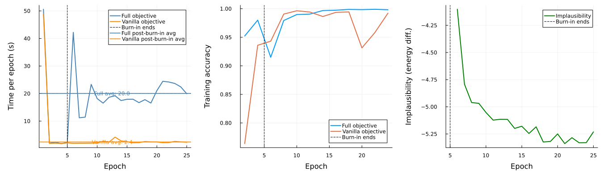

# Training on GPU

This page demonstrates GPU training with the `Native` submodule of CounterfactualTraining.jl.

## Two Training Approaches

The package provides two training approaches that share the same `counterfactual_training` entry point (dispatch is based on the generator type):

1. **Research branch** (non-native): Uses `CounterfactualExplanations.jl` structs (`GenericGenerator`, `CounterfactualExplanation`) and `TaijaParallel.parallelize` for per-sample counterfactual generation. Heavier and slower, but fully featured. Dispatched when `generator` is **not** a `NativeGenerator`.

2. **Performance branch** (`Native` submodule): A lightweight, batched, GPU-friendly generator (`NativeGenerator`) that operates directly on `D×N` matrices without allocating `CounterfactualExplanation` objects per sample. Much faster and GPU-compatible. Dispatched when `generator isa NativeGenerator`.

The `Native` branch was added as part of the performance optimization effort and is the recommended approach for most use cases.

## Setup

```{julia}
#| echo: true

using CounterfactualTraining
using CounterfactualTraining.Native
using CounterfactualExplanations
using Flux
using Metalhead
using Plots
using Random
using MLDatasets

Random.seed!(42)
gr()
```

## GPU Detection

The code below detects available GPU backends (CUDA or AMDGPU) and falls back to CPU if none is available. This makes the example runnable in any environment, including CI.

```{julia}
#| echo: true

has_gpu = false
device = identity

# Try CUDA
try
    using CUDA
    if CUDA.functional()
        global has_gpu = true
        global device = Flux.gpu
    end
catch
end

# Try AMD
if !has_gpu
    try
        using AMDGPU
        if AMDGPU.functional()
            global has_gpu = true
            global device = Flux.gpu
        end
    catch
    end
end

if has_gpu
    @info "GPU detected — training will run on GPU."
else
    @info "No GPU available — training will run on CPU."
end
```

## Loading MNIST

We load MNIST via `MLDatasets.jl`, flatten the 28×28 images to 784-dimensional vectors, and normalize pixel values to `[-1, 1]`. A subset of 5,000 samples is used to keep the example fast.

```{julia}
#| echo: true

train_data = MLDatasets.MNIST(; split=:train)
X = Float32.(reshape(train_data.features, 784, :)) .* 2f0 .- 1f0
y = train_data.targets .+ 1  # convert 0-9 labels to 1-10

idx = shuffle(1:size(X, 2))[1:5000]
X, y = X[:, idx], y[idx]

domain = [(-1.0f0, 1.0f0) for _ in 1:784]
y_onehot = Flux.onehotbatch(y, 1:10)

# Keep the data on the device so the training loop's `input |> device` is a
# cheap no-op instead of a per-batch H2D copy.
X = X |> device
y_onehot = y_onehot |> device
train_set = Flux.DataLoader((X, y_onehot); batchsize=128, shuffle=true)
```

## Model

We use a ResNet-18 from `Metalhead.jl`, configured for single-channel 28×28 MNIST inputs and 10 output classes. The native counterfactual pipeline operates on flattened `D×N` matrices throughout (see `generate_counterfactuals!` in `src/native/training.jl`), so we wrap the backbone in a `Chain` that reshapes the 784-dimensional input back to `28×28×1×N` before the first convolution. This keeps the counterfactual search in pixel space, where the per-pixel `domain` bounds (`(-1, 1)`) and mutability constraints remain valid, without requiring changes to the matrix-typed pipeline.

```{julia}
#| echo: true

backbone = ResNet(18; inchannels=1, nclasses=10)
model = Chain(x -> reshape(x, 28, 28, 1, :), backbone)
```

## Training

We compare two objectives to illustrate the overhead of the counterfactual pipeline: `FullObjective` (generates counterfactuals each epoch after burn-in) and `VanillaObjective(; needs_ce=false)` (standard training, no CF generation). Both runs use the same model, optimizer, and hyperparameters, and start from identical initial weights (`Random.seed!(42)` is re-seeded before constructing each model). The training `log` records `time_taken` per epoch in both branches, so we plot the per-epoch wall-clock time for the two objectives.

```{julia}
nepochs = 10
verbose = 2
opt = Flux.Adam(1e-3)
nce = 128
# cf_batchsize is a GPU-memory knob for the CF search; 128 (= nce, so no
# chunking) is fastest here — lower it only on memory-constrained GPUs.
cf_batchsize = 128
accuracy_every = div(nepochs, 5)
burnin = 0.2f0
burnin_epochs = Int(round(burnin * nepochs))
```

### Full objective

```{julia}
#| echo: true
#| eval: false

Random.seed!(42)
model_full = Chain(x -> reshape(x, 28, 28, 1, :), ResNet(18; inchannels=1, nclasses=10))

gen = NativeGenerator()
obj = FullObjective()
opt_state = Flux.setup(opt, model_full);

model_full, log_full = counterfactual_training(
    obj, model_full, gen, train_set, opt_state;
    device, nepochs, domain, verbose, accuracy_every,
    nce, cf_batchsize, 
    maxiter=30, burnin=burnin
)
```

### Vanilla objective

```{julia}
#| echo: true
#| eval: false

Random.seed!(42)
model_vanilla = Chain(x -> reshape(x, 28, 28, 1, :), ResNet(18; inchannels=1, nclasses=10))

obj_vanilla = VanillaObjective(; needs_ce=false)
opt_state_vanilla = Flux.setup(opt, model_vanilla);

model_vanilla, log_vanilla = counterfactual_training(
    obj_vanilla, model_vanilla, gen, train_set, opt_state_vanilla;
    device, nepochs, domain, verbose, accuracy_every,
)
```

### Timing and accuracy comparison

```{julia}
#| echo: true
#| eval: false
# Timing
t_full = [l.time_taken for l in log_full]
t_vanilla = [l.time_taken for l in log_vanilla]

# Accuracy (non-nothing epochs only — depends on accuracy_every)
epochs_acc = [i for (i, l) in enumerate(log_full) if !isnothing(l.acc)]
acc_full = [l.acc for l in log_full if !isnothing(l.acc)]
acc_vanilla = [l.acc for l in log_vanilla if !isnothing(l.acc)]

plt1 = plot(
    1:length(t_full), t_full;
    label="Full objective",
    xlabel="Epoch", ylabel="Time per epoch (s)", lw=2,
)
plot!(plt1, 1:length(t_vanilla), t_vanilla; label="Vanilla objective", lw=2)
vline!(plt1, [burnin_epochs]; label="Burn-in ends", ls=:dash, color=:black)

plt2 = plot(
    epochs_acc, acc_full;
    label="Full objective",
    xlabel="Epoch", ylabel="Training accuracy", lw=2,
)
plot!(plt2, epochs_acc, acc_vanilla; label="Vanilla objective", lw=2)
vline!(plt2, [burnin_epochs]; label="Burn-in ends", ls=:dash, color=:black)

combined = plot(
    plt1, plt2;
    layout=(1, 2),
    size=(900, 400),
    bottom_margin=10Plots.mm,
    left_margin=10Plots.mm,
)
savefig(combined, "docs/src/assets/gpu.svg")
```



The figure above compares the two objectives side by side. The left panel shows per-epoch wall-clock time; the right panel shows training accuracy. The gap between the two curves in the left panel reflects the cost of generating counterfactuals each epoch (the per-sample batched search in `generate_native!`). Expect the difference to appear only after the burn-in fraction, since `VanillaObjective(; needs_ce=false)` short-circuits CF generation entirely via `needs_counterfactuals`. The right panel confirms that both objectives achieve comparable training accuracy, indicating that the counterfactual regularization does not degrade the discriminative performance of the model.

## Performance tips

- **Keep the full dataset on the device** before building the `DataLoader` (as shown above) so the training loop's `input |> device` is a no-op rather than a per-batch copy.
- **Set `cf_batchsize` as large as memory allows** to avoid chunking the counterfactual search (e.g. `128` when `nce = 128`). Lower it only on memory-constrained GPUs.
- **Use `accuracy_every`** (e.g. `div(nepochs, 5)`) to skip per-epoch accuracy when wall-clock time matters.
- For **BatchNorm models**, consider `fuse_cf_forwards = true` only if slightly different batch statistics are acceptable (it fuses the three counterfactual forward passes into one).

