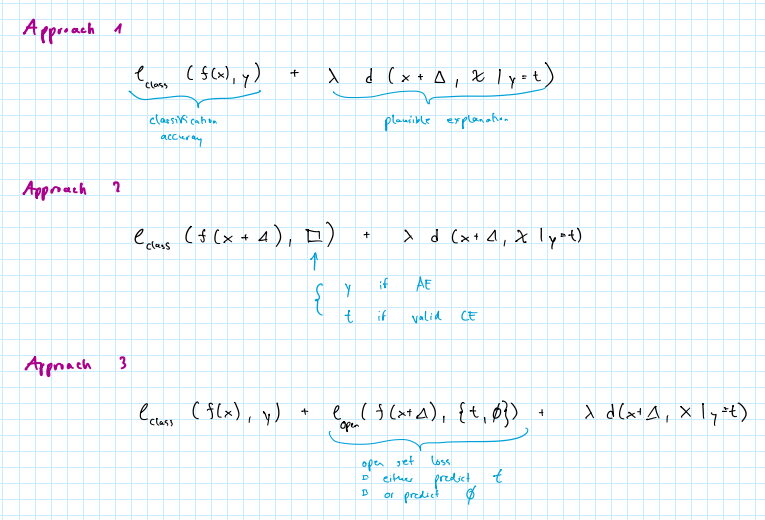

## 2024-10-03

### Issues

- AE or CE? It's not obvious how to determine whether the counterfactual is missclassified (i.e. AE) or not.
  - What should we use as the ground-truth label? 
- Does it make sense to use block-wise gradient descent in our case?
- Can we use Taylor approximation as Ross et al.?
- How to avoid the burnin approach?

### Ideas

- Could use open set classification to give network one more degree of freedom?

